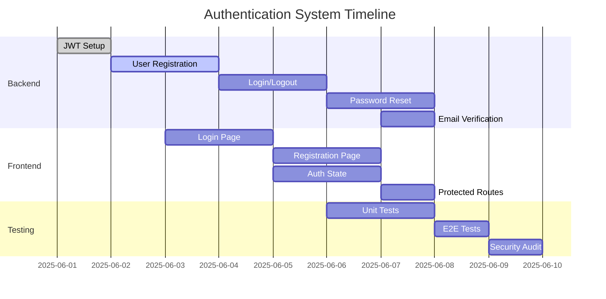

# Authentication System Implementation Plan

**Branch Name:** `feature/authentication-system`  
**Target Completion:** 2025-06-07  
**Status:** 🟡 In Progress  
**Priority:** 🔴 High

## 📋 Overview
This document outlines the implementation plan for the authentication system of Namesearch.io, including user registration, login, password management, and session handling.

## 🎯 Objectives
1. Implement secure user authentication with JWT
2. Create responsive authentication UI components
3. Set up protected routes and role-based access control
4. Implement password reset and email verification flows
5. Ensure security best practices are followed

## 🧩 Task Breakdown

### 1. Backend Authentication Service
- [ ] Set up JWT token generation and validation
- [ ] Implement user registration endpoint
- [ ] Create login/logout endpoints
- [ ] Set up password hashing with bcrypt
- [ ] Implement refresh token rotation
- [ ] Create email verification flow
- [ ] Set up password reset functionality
- [ ] Implement rate limiting for auth endpoints
- [ ] Add audit logging for security events
- [ ] Set up session management

### 2. Frontend Authentication
- [ ] Create login page
- [ ] Create registration page
- [ ] Implement password reset flow
- [ ] Create email verification components
- [ ] Set up auth state management with Zustand
- [ ] Implement protected routes
- [ ] Create auth context provider
- [ ] Add loading states and error handling
- [ ] Implement persistent sessions
- [ ] Add social login (Google, GitHub)

### 3. Security Measures
- [ ] Implement CSRF protection
- [ ] Set up secure HTTP-only cookies
- [ ] Add password strength validation
- [ ] Implement account lockout after failed attempts
- [ ] Set up security headers
- [ ] Add reCAPTCHA for public forms
- [ ] Implement security question/2FA (future phase)

## 🛠 Technical Implementation

### Backend (FastAPI)
```python
# Example auth router
@router.post("/register", response_model=UserResponse)
async def register(user_data: UserCreate):
    # Check if user exists
    # Hash password
    # Create user in DB
    # Send verification email
    pass

@router.post("/login")
async def login(response: Response, credentials: OAuth2PasswordRequestForm = Depends()):
    # Validate credentials
    # Generate tokens
    # Set secure http-only cookies
    pass
```

### Frontend (React/TypeScript)
```typescript
// Auth store using Zustand
const useAuthStore = create<AuthState>((set) => ({
  user: null,
  isAuthenticated: false,
  loading: false,
  error: null,
  login: async (email, password) => {
    // API call to login
    // Update state
  },
  logout: () => {
    // Clear tokens and state
  },
  // ...
}));
```

## 📅 Timeline


## ✅ Acceptance Criteria
- [ ] Users can register with email and password
- [ ] Users receive verification emails
- [ ] Password reset flow works end-to-end
- [ ] JWT tokens are properly validated
- [ ] Protected routes redirect unauthenticated users
- [ ] Session persists across page refreshes
- [ ] All auth endpoints are rate limited
- [ ] Comprehensive test coverage

## 🔒 Security Considerations
- Use HTTP-only, secure, same-site cookies
- Implement proper CORS policies
- Sanitize all user inputs
- Use parameterized queries
- Set secure headers (CSP, HSTS, etc.)
- Log security events
- Regular dependency updates

## 📚 Dependencies
- FastAPI
- Python-jose (JWT)
- Passlib (hashing)
- python-multipart (form handling)
- React Hook Form
- Zod (validation)
- Zustand (state management)
- React Router v6

## 📝 Notes
- Follow OWASP authentication guidelines
- Consider implementing 2FA in future phase
- Plan for social login integration
- Document API endpoints with OpenAPI/Swagger
