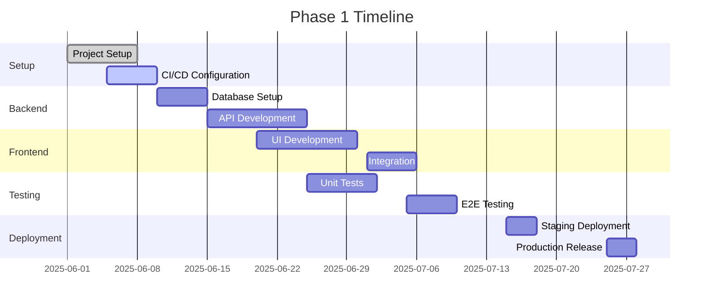

# Phase 1: Foundation Implementation Plan

**Branch Name:** `feature/phase1-foundation`  
**Target Completion:** 2025-07-30  
**Status:** 🟡 In Planning

## 📋 Overview
This document outlines the implementation plan for Phase 1 of Namesearch.io, focusing on establishing the core infrastructure and basic functionality.

## 🎯 Objectives
1. Set up robust development environment and CI/CD pipeline (GitHub Actions, Docker Compose)
2. Implement secure, scalable backend (FastAPI, PostgreSQL, Redis, Celery, RabbitMQ)
3. Build modern, responsive frontend (React 18, TypeScript, Vite, TailwindCSS, Shadcn UI, Framer Motion)
4. Integrate advanced state management (Zustand, React Query, Context API, Immer)
5. Establish feature-based, atomic design component architecture
6. Implement authentication (JWT, secure storage, refresh flow)
7. Deliver core features: domain checker, linguistic analysis, brand archetype, trend forecasting, legal screening, project workspace, watchlist/alerts
8. Ensure high quality: testing (Jest, React Testing Library, Cypress), linting (ESLint), formatting (Prettier), monitoring (Sentry, Posthog, Lighthouse)
9. Document all architecture, API, and user/developer guides

## 🧩 High-level Task Breakdown

### 1. Project Setup & Infrastructure
- [ ] Initialize git repository
- [ ] Add all existing untracked directories and files (backend/, frontend/, etc.) to git
- [ ] Commit the full initial project structure
- [ ] Push the commit(s) to the remote GitHub repository (origin/main)
- [ ] Create and switch to feature branch `feature/phase1-foundation` for further development
- [ ] Set up Python virtual environment with Poetry
- [ ] Configure pre-commit hooks
- [ ] Set up linting and formatting (Black, isort, flake8)
- [ ] Configure testing framework (pytest)
- [ ] Set up CI/CD with GitHub Actions
- [ ] Configure Docker and docker-compose for local development

### 2. Backend Development
- [ ] Set up FastAPI application structure
- [ ] Configure database connection (PostgreSQL)
- [ ] Implement basic user authentication
- [ ] Create WHOIS lookup service
- [ ] Set up Redis for caching
- [ ] Implement basic API endpoints
  - [ ] Domain lookup
  - [ ] Project management
  - [ ] User authentication

### 3. Frontend Development
- [ ] Initialize React 18 + TypeScript project with Vite
- [ ] Set up TailwindCSS, Shadcn UI, Radix UI, Framer Motion
- [ ] Establish atomic/component architecture:
  - [ ] `src/components/atoms/`, `molecules/`, `organisms/`, `templates/`
  - [ ] `src/features/` (auth, domain-check, name-analysis, workspaces, legal-check, trends, settings)
  - [ ] `src/hooks/`, `lib/`, `providers/`, `routes/`, `services/`, `stores/`, `styles/`, `types/`, `utils/`
- [ ] Implement state management:
  - [ ] Zustand for global state
  - [ ] React Query for server state
  - [ ] Context API for local state
  - [ ] Immer for immutability
- [ ] Routing:
  - [ ] React Router or @tanstack/router for type-safe, nested routing
- [ ] Form management:
  - [ ] React Hook Form + Zod for validation
- [ ] Internationalization:
  - [ ] i18next, react-i18next
- [ ] Implement core features/components:
  - [ ] DomainAvailabilityChecker
  - [ ] LinguisticAnalysis
  - [ ] BrandArchetypeAlignment
  - [ ] TrendForecasting
  - [ ] LegalPreScreening
  - [ ] ProjectWorkspace
  - [ ] NameWatchlist
  - [ ] Advanced Search Panel UI (AdvancedSearchPanel.tsx)
    - Status: In Progress (Core JSX syntax error resolved)
    - Current Sub-Task: Incrementally restoring JSX to isolate any further issues.
    - Details: 
        - The component was simplified to `return (
Test
);` to fix a persistent syntax error (extraneous `);`). This was successful.
        - **Next:** Restore the outer panel shell (overlay, header, API/results placeholders). The main `<form>` will remain **intentionally and temporarily commented out** during this step.
        - *Expected:* Many 'unused variable' warnings will persist until the form and its handlers are fully restored. This is a known, temporary state.
        - *Goal:* Achieve a stable panel structure, then incrementally uncomment/debug the form sections to achieve full functionality and eliminate all lint errors.
- [ ] Responsive design (mobile-first, Tailwind breakpoints, adaptive layouts)
- [ ] Performance optimizations (code splitting, lazy load, virtual lists, asset optimization)
- [ ] Integrate monitoring/analytics (Sentry, Posthog, Lighthouse)
- [ ] Set up testing: Jest, React Testing Library, Cypress
- [ ] Linting/formatting: ESLint, Prettier

### 4. Database Design
- [ ] Design and implement initial schema
  - Users
  - Projects
  - Domains
  - Searches
- [ ] Set up Alembic for migrations
- [ ] Create initial seed data

### 5. Testing & Quality Assurance
- [ ] Write unit tests for backend services
- [ ] Implement integration tests
- [ ] Set up test coverage reporting
- [ ] Perform security audit

## 📊 Success Criteria
- [ ] All local project structure and documentation are tracked in git and visible on GitHub
- [ ] WHOIS lookup functionality working end-to-end
- [ ] Basic project management features implemented
- [ ] User authentication functional
- [ ] Test coverage > 80%
- [ ] CI/CD pipeline passing
- [ ] Documentation complete

## ⚠️ Risks & Mitigation
| Risk | Impact | Likelihood | Mitigation |
|------|--------|------------|------------|
| WHOIS API rate limiting | High | Medium | Implement caching, fallback providers |
| Database performance | High | Low | Optimize queries, add indexes |
| Frontend performance | Medium | Medium | Code splitting, lazy loading |

## 📅 Timeline

## 🛠️ Technical Decisions
- **Frontend:**
  - React 18 for UI, atomic/component architecture for maintainability
  - TypeScript 5+ for type safety and DX
  - Vite for fast HMR and optimized builds
  - TailwindCSS for utility-first, responsive design
  - Shadcn UI/Radix UI for accessible, customizable primitives
  - Framer Motion for animation
  - Zustand, React Query, Immer, Context API for state management
  - React Router/@tanstack/router for routing
  - React Hook Form + Zod for forms/validation
  - i18next/react-i18next for i18n
  - Jest, React Testing Library, Cypress for testing
  - Sentry, Posthog, Lighthouse for monitoring/analytics
  - ESLint, Prettier for code quality
- **Backend:**
  - FastAPI for async APIs and OpenAPI docs
  - PostgreSQL 15+ (JSONB, reliability)
  - Redis for caching
  - Celery + RabbitMQ for async tasks
  - SQLAlchemy ORM, Alembic for migrations
  - JWT auth with access/refresh, Argon2id/bcrypt, role-based access, API keys
  - Security: rate limiting, CSRF/XSS, secure env vars
- **DevOps:**
  - Docker Compose for local dev
  - NGINX + Gunicorn for prod
  - Terraform/Ansible for infra/config
  - GitHub Actions for CI/CD
  - Prometheus/Grafana for monitoring, ELK/Loki for logging

## 📚 Documentation
- [API Documentation](#) (Will be auto-generated)
- [Development Setup](#) (In README.md)
- [Deployment Guide](#) (To be created)

## 📋 Project Status Board

### ✅ Completed
- Initial project structure
- Documentation setup

### 🟡 In Progress
- Setting up development environment
- CI/CD configuration
- Preparing all local files for git tracking and push to GitHub
- Frontend: Admin dashboard shell and protected route implemented, dev server running
- Backend: Admin endpoints for dashboard analytics, user/project management, logs, and API key management scaffolded and registered

### ⏳ Up Next
- Create and switch to feature branch `feature/phase1-foundation`
- Database schema design
- API development

## ❓ Executor's Feedback or Assistance Requests
- Current focus: Incrementally restoring JSX. Successfully fixed core syntax error by simplifying return to `
Test
` and removing extraneous `);`. Next: restore panel shell (overlay, header, API/result placeholders) while keeping form commented.
- Immediate next steps: Connect frontend admin dashboard to backend admin APIs and implement real data fetching for admin widgets.

## 📝 Lessons Learned
- Initial setup with Poetry and Vite was straightforward
- Need to consider rate limiting for WHOIS lookups early on
- Docker networking needs careful configuration for local development
