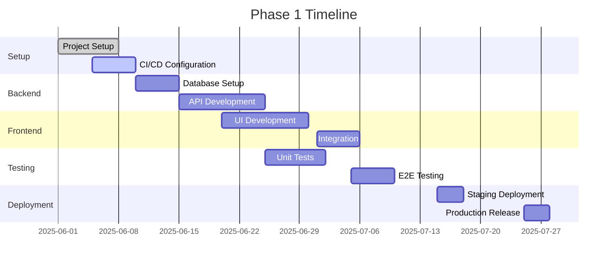

# Phase 1: Foundation Implementation Plan

**Branch Name:** `feature/phase1-foundation`  
**Target Completion:** 2025-07-30  
**Status:** 🟡 In Planning

## 📋 Overview
This document outlines the implementation plan for Phase 1 of Namesearch.io, focusing on establishing the core infrastructure and basic functionality.

## 🎯 Objectives
1. Set up development environment and CI/CD pipeline
2. Implement basic WHOIS lookup functionality
3. Create initial frontend interface
4. Establish database schema and API structure
5. Implement basic project management features

## 🧩 High-level Task Breakdown

### 1. Project Setup & Infrastructure
- [ ] Initialize git repository
- [ ] Add all existing untracked directories and files (backend/, frontend/, etc.) to git
- [ ] Commit the full initial project structure
- [ ] Push the commit(s) to the remote GitHub repository (origin/main)
- [ ] Create and switch to feature branch `feature/phase1-foundation` for further development
- [ ] Set up Python virtual environment with Poetry
- [ ] Configure pre-commit hooks
- [ ] Set up linting and formatting (Black, isort, flake8)
- [ ] Configure testing framework (pytest)
- [ ] Set up CI/CD with GitHub Actions
- [ ] Configure Docker and docker-compose for local development

### 2. Backend Development
- [ ] Set up FastAPI application structure
- [ ] Configure database connection (PostgreSQL)
- [ ] Implement basic user authentication
- [ ] Create WHOIS lookup service
- [ ] Set up Redis for caching
- [ ] Implement basic API endpoints
  - [ ] Domain lookup
  - [ ] Project management
  - [ ] User authentication

### 3. Frontend Development
- [ ] Initialize React + TypeScript project with Vite
- [ ] Set up TailwindCSS and Shadcn UI
- [ ] Create basic layout and navigation
- [ ] Implement domain search interface
- [ ] Create project management views
- [ ] Set up state management (React Query)

### 4. Database Design
- [ ] Design and implement initial schema
  - Users
  - Projects
  - Domains
  - Searches
- [ ] Set up Alembic for migrations
- [ ] Create initial seed data

### 5. Testing & Quality Assurance
- [ ] Write unit tests for backend services
- [ ] Implement integration tests
- [ ] Set up test coverage reporting
- [ ] Perform security audit

## 📊 Success Criteria
- [ ] All local project structure and documentation are tracked in git and visible on GitHub
- [ ] WHOIS lookup functionality working end-to-end
- [ ] Basic project management features implemented
- [ ] User authentication functional
- [ ] Test coverage > 80%
- [ ] CI/CD pipeline passing
- [ ] Documentation complete

## ⚠️ Risks & Mitigation
| Risk | Impact | Likelihood | Mitigation |
|------|--------|------------|------------|
| WHOIS API rate limiting | High | Medium | Implement caching, fallback providers |
| Database performance | High | Low | Optimize queries, add indexes |
| Frontend performance | Medium | Medium | Code splitting, lazy loading |

## 📅 Timeline

## 🛠️ Technical Decisions
- Using FastAPI for its async capabilities and automatic OpenAPI documentation
- PostgreSQL for its JSONB support and reliability
- React with TypeScript for type safety and better developer experience
- TailwindCSS for rapid UI development
- Docker for consistent development environments

## 📚 Documentation
- [API Documentation](#) (Will be auto-generated)
- [Development Setup](#) (In README.md)
- [Deployment Guide](#) (To be created)

## 📋 Project Status Board

### ✅ Completed
- Initial project structure
- Documentation setup

### 🟡 In Progress
- Setting up development environment
- CI/CD configuration
- Preparing all local files for git tracking and push to GitHub

### ⏳ Up Next
- Create and switch to feature branch `feature/phase1-foundation`
- Database schema design
- API development

## ❓ Executor's Feedback or Assistance Requests
- Current state: All progress is local only; remote GitHub repository is empty.
- Immediate next steps: Add, commit, and push all local files to origin/main, then create and switch to feature branch for Phase 1 work.

## 📝 Lessons Learned
- Initial setup with Poetry and Vite was straightforward
- Need to consider rate limiting for WHOIS lookups early on
- Docker networking needs careful configuration for local development
